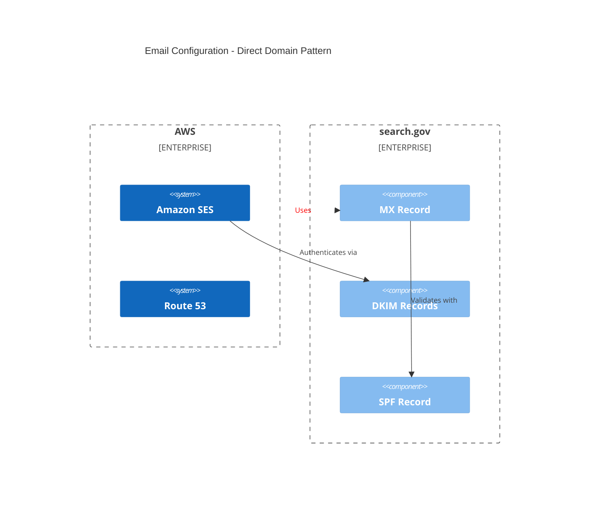
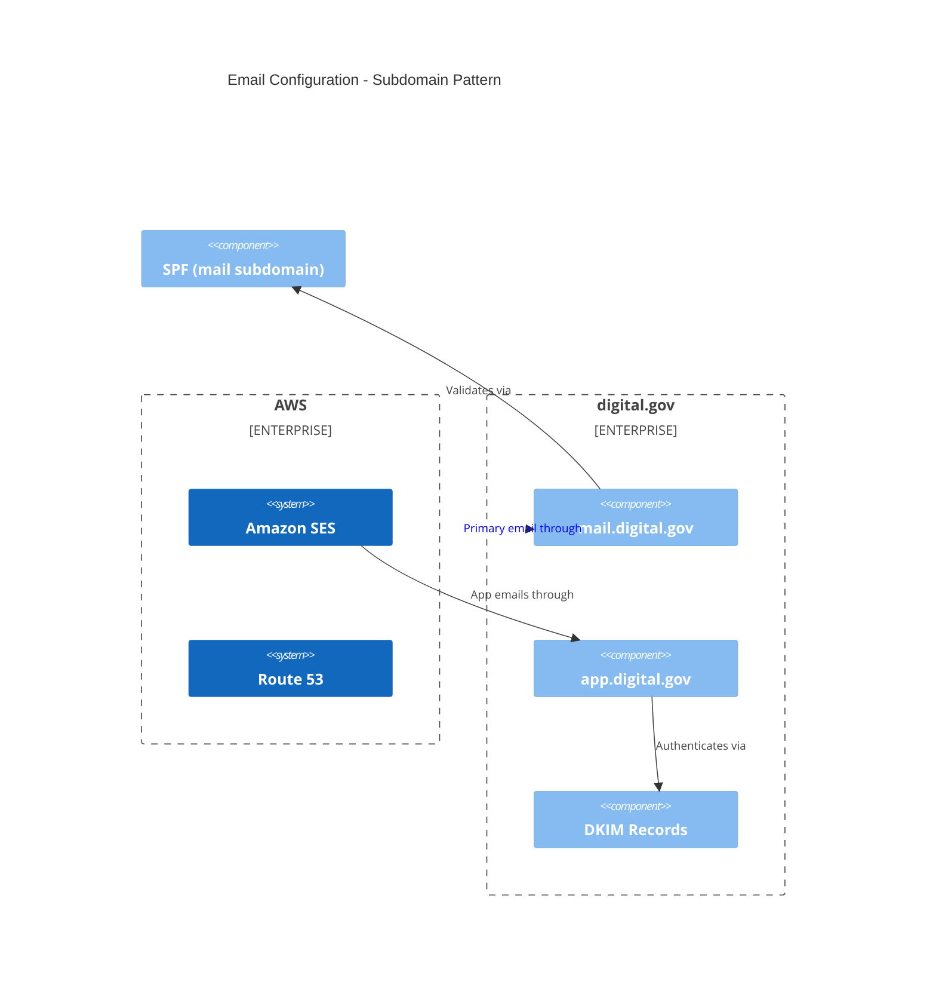
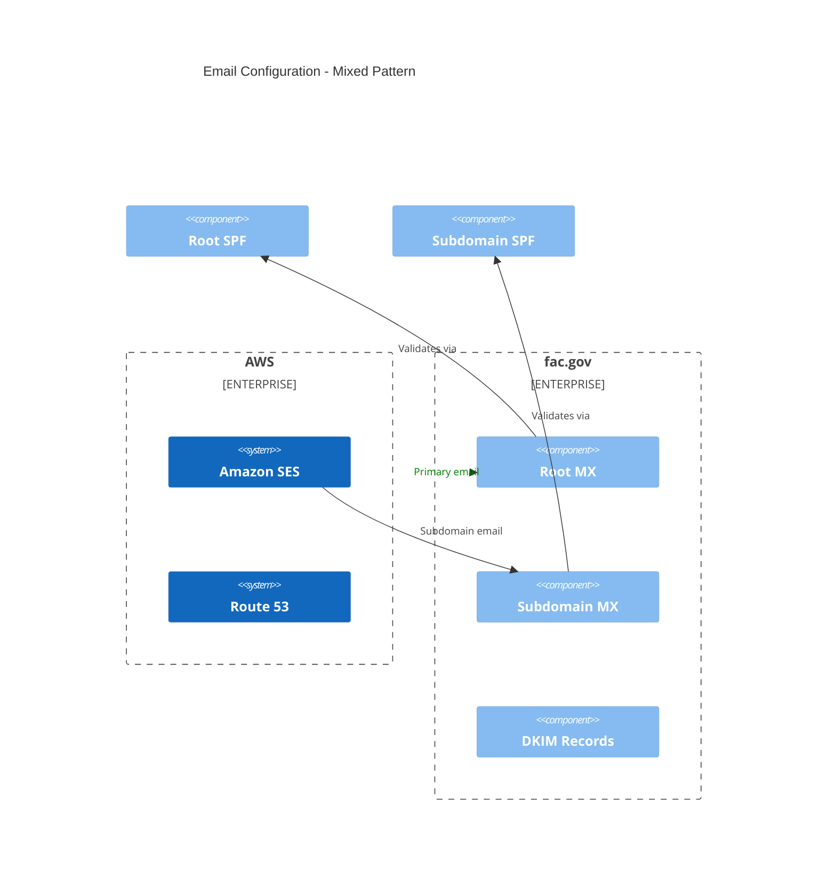

# Email DNS Architecture Patterns

This guide explains the different approaches to email-related DNS configurations across our domains.

## Overview

We have three main patterns for email DNS configuration:

1. Direct Domain Pattern (search.gov)
2. Subdomain Pattern (digital.gov)
3. Mixed Pattern (fac.gov)

## Architecture Diagrams

### Direct Domain Pattern (search.gov)



### Subdomain Pattern (digital.gov)



### Mixed Pattern (fac.gov)



## Pattern Comparison

### Direct Domain Pattern (search.gov)
- MX records at root domain
- DKIM records directly under domain
- Single SPF record at root
- Pros: Simple, straightforward
- Cons: Less flexibility, all mail config at root

### Subdomain Pattern (digital.gov)
- MX records on subdomains
- DKIM per subdomain
- Separate SPF records per subdomain
- Pros: Better isolation, flexible routing
- Cons: More complex management

### Mixed Pattern (fac.gov)
- MX records at both root and subdomains
- Shared DKIM records
- Multiple SPF records
- Pros: Maximum flexibility
- Cons: Most complex to manage

## Implementation Details

### Direct Domain Pattern
```hcl
resource "aws_route53_record" "mx" {
  zone_id = aws_route53_zone.zone.zone_id
  name    = ""  # Root domain
  type    = "MX"
  records = ["10 inbound-smtp.amazonaws.com"]
}
```

### Subdomain Pattern
```hcl
resource "aws_route53_record" "mx_subdomain" {
  zone_id = aws_route53_zone.zone.zone_id
  name    = "mail.domain.gov"
  type    = "MX"
  records = ["10 inbound-smtp.amazonaws.com"]
}
```

### Mixed Pattern
```hcl
resource "aws_route53_record" "mx_mixed" {
  zone_id = aws_route53_zone.zone.zone_id
  name    = each.key
  type    = "MX"
  for_each = {
    ""            = ["10 primary-smtp.amazonaws.com"]
    "department1" = ["10 dept1-smtp.amazonaws.com"]
    "department2" = ["10 dept2-smtp.amazonaws.com"]
  }
  records = each.value
}
```

## Best Practices

1. **Choose Based on Requirements**:
   - Simple email: Direct Pattern
   - Multiple services: Subdomain Pattern
   - Complex routing: Mixed Pattern

2. **Security Considerations**:
   - Always implement both SPF and DKIM
   - Consider DMARC for all patterns
   - Use separate DKIM keys per subdomain

3. **Maintainability**:
   - Document pattern choice
   - Use consistent naming
   - Implement using Terraform modules

4. **Monitoring**:
   - Set up alerts for record expiration
   - Monitor email delivery statistics
   - Track bounce rates per pattern

## Migration Considerations

When moving between patterns:

1. Plan for DNS propagation time
2. Maintain old records during transition
3. Update SPF records gradually
4. Monitor email delivery during change

## Related Documentation
- [AWS SES DNS Configuration](https://docs.aws.amazon.com/ses/latest/dg/dns-verification.html)
- [DKIM Best Practices](https://docs.aws.amazon.com/ses/latest/dg/send-email-authentication-dkim.html)
- [SPF Record Syntax](https://docs.aws.amazon.com/ses/latest/dg/send-email-authentication-spf.html)
